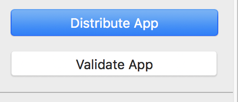

# 2019 年如何在 App Store 上架一个 iOS App？

iTunes Connect 改版为 App Store 之后上架流程发生了一些变化；我最近正好碰到了一个上架需求，因为网上的上架流程已经过时，所以记录一下。

## 在 App Store 注册 App ID

首先假设你已经拥有了开发者账户（个人 or 企业），访问[App Store Connect](https://appstoreconnect.apple.com)，选择「我的 App」。

选择「新建 App」后填写相关信息；注意，`套装 ID`即 Bundle ID 要在「Certificates, Identifiers & Profiles」中的「Identifiers」中提前注册，`Bundle ID` 的 `NAME` 项尽量与 App 同名。

之后在项目详情页中即可浏览`套装 ID`、`SKU`、`Apple ID`（此处的 `Apple ID` 即为 `App ID`）。可以编辑相关的信息，如描述、截图等等。

## 在 Xcode 打包 IPA

在其他教程中会要求你在「Certificates」中自行注册一个`iOS Distribution`的许可，但经过实测亦可在打包时自动生成，以下是流程。

首先，在项目的「General」项设置`Bundle Identifier`，此处与预先设置的`Bundle ID`一致。同时注意`Build`版本，若版本与 App Store Connect 的版本相冲突，则无法上传。

然后将设备切换为「Generic iOS Device」后开始`archive`。

生成完毕后选择`Distribue App`。

选择「iOS App Store」发布。

选择自动签名，若你的 Xcode 已经登录了与 App Store Connect 相同的开发者账户，此时 Xcode 会自动提醒你生成 Distribution 专用的认证和相关签名，签名为 pem 文件，本地保存后双击打开进行安装。

然后选择`Export`保存生成的 IPA 包到本地。

## 使用 Application Loader 上传 IPA

在 Xcode 的「Open Develop Tools」中打开 Application Loader。

然后用开发者账户登录。此处有巨坑：登录的 Password 要单独在 Apple Account 中申请一个单独的 App 内专用 Password。

之后**保持一个畅通的网络**，按照 Application Loader 的提示上传即可。

## 在 TestFlight 中测试应用

在我们上传 IPA 包后在 App Store Connect 中已经可以看到相应的「构筑版本」。

内测的流程是首先添加内部测试员，添加完毕后即可发送邀请邮件。

外测的流程有所不同，首先要把 App 提交 BETA 版本审核，审核的过程可能是 1-2 天，随后即可添加外部测试群组。外测更加方便，因为会生成相应的TestFlight Link，复制发给外部测试员即可开始测试。

## 正式上架

测试完毕后，在App Store项填完相应的信息，即可提交审核。

选择对应的发布方式来选择审核通过后的发布策略。

